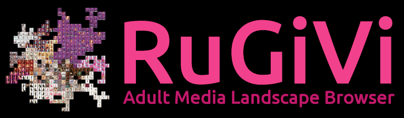

<h1 align="center"> RuGiVi - Adult media landscape browser </h1>


RuGiVi enables you to fly over your image and video collection and view thousands of images and video frames at once. Zoom in and out from one image to small thumbnails with your mousewheel in seconds. All images are grouped as you have them on your disk and arranged in a huge landscape. RuGiVi can work with hundred thousand of images at once.

<div align="center"> <font size="+2">

[Install for Windows](#windows-installation) &nbsp;&nbsp;&nbsp;&nbsp; [Install for Linux](#ubuntu-linux-installation)

</font></div>

## Screenshots

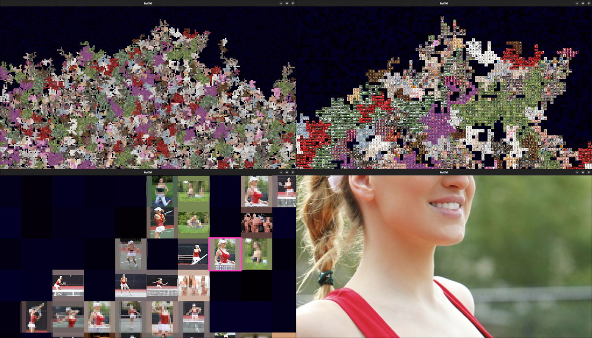

RuGiVi integrates fully into the [Fapel-System](https://github.com/pronopython/fapel-system), so you can travel trough your collection and tag images as you fly over them!

Fly over thumbnails and zoom in on any image anytime in an instant!

> :eggplant: :sweat_drops: *Note: All sample images on this page are censored*


Image Landscape generation from your directory structure:

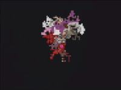

Zooming and wandering around:

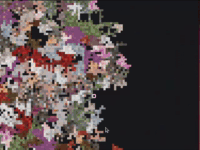

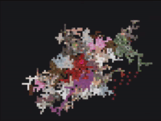

Double click preview:


Always visible, floating Fapel Tables:

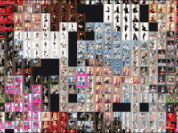


RuGiVi works with images...

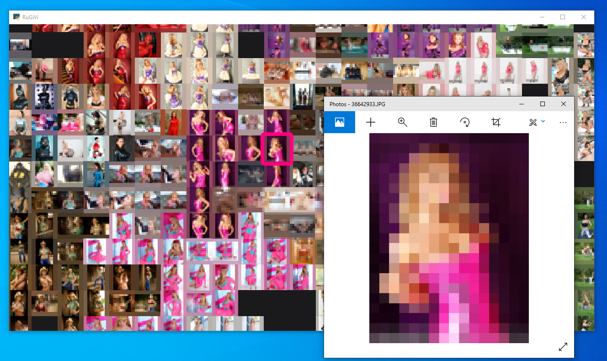

...and with videos, which it displays as a set of video still frames in the landscape:

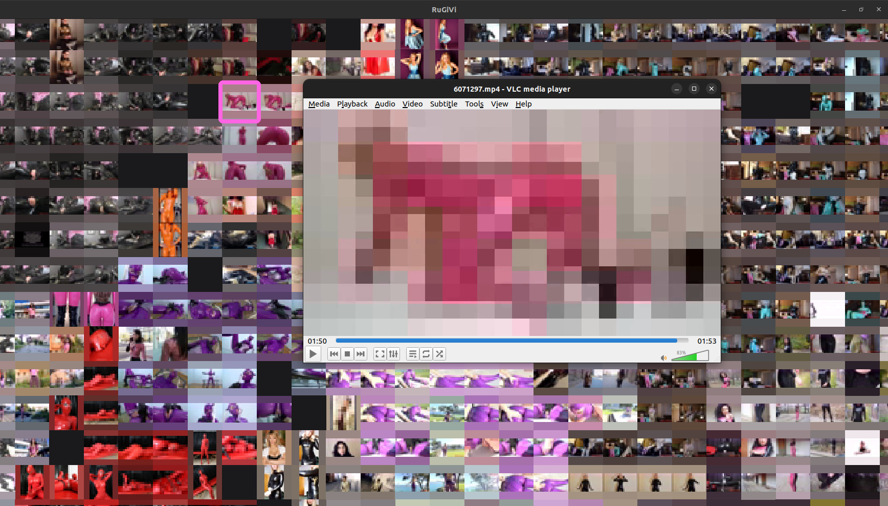

(Everything here is obviously censored ;-) )

Zoom in...


And zoom out

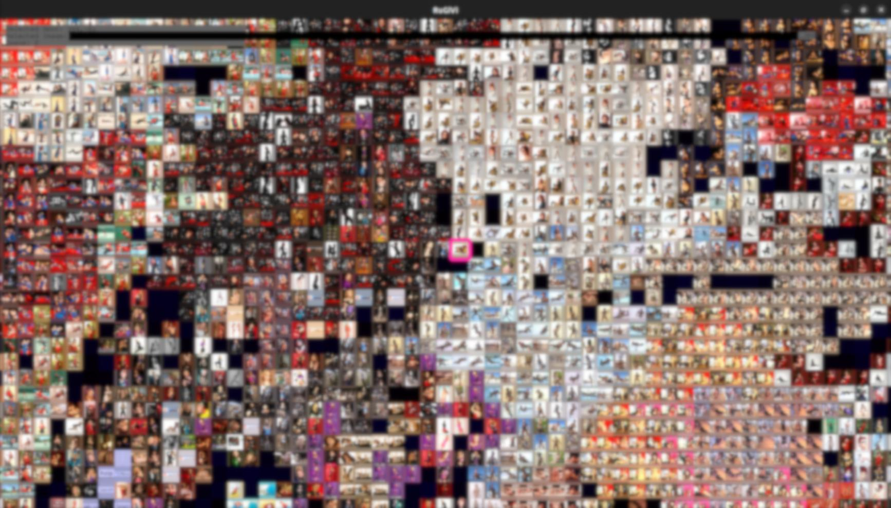

Left doubleclick enables a peepy preview.
Every rectangle is one image which you can zoom into.
Images within one directory are always placed randomly next to each other in an organic fashion. You also clearly can see different image directories: Ones which contain a mix of different images (random colors) and ones with one photo set (uniform color).

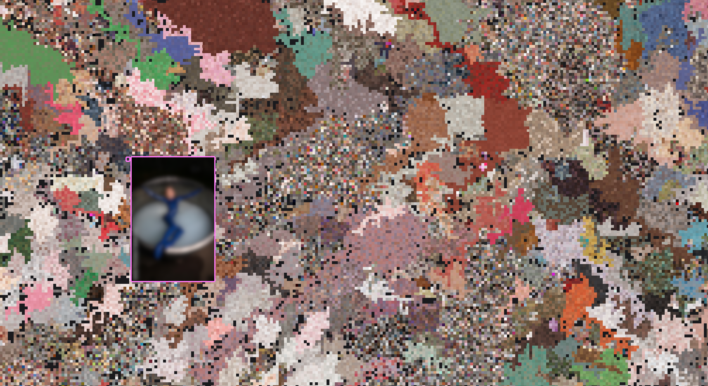

RuGiVi saves all generated thumbnails in a database and can load these on the fly at the next session.
Here you can see chunks (rectangular blocks of 32 x 32 pictures) being loaded from thumb database (on this system at around 800-1000 thumbs per second).
The pattern like structure between pictures and red empty spots on the right is RuGiVis dynamic screen update mechanism, which favors pattern like update and tearing over broken fps.


You can also export a world map:

**World with 75,000 images** (1 pixel = 1 image)

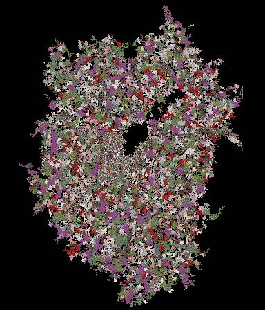


**World with 700,000 images** (1 pixel = 1 image)

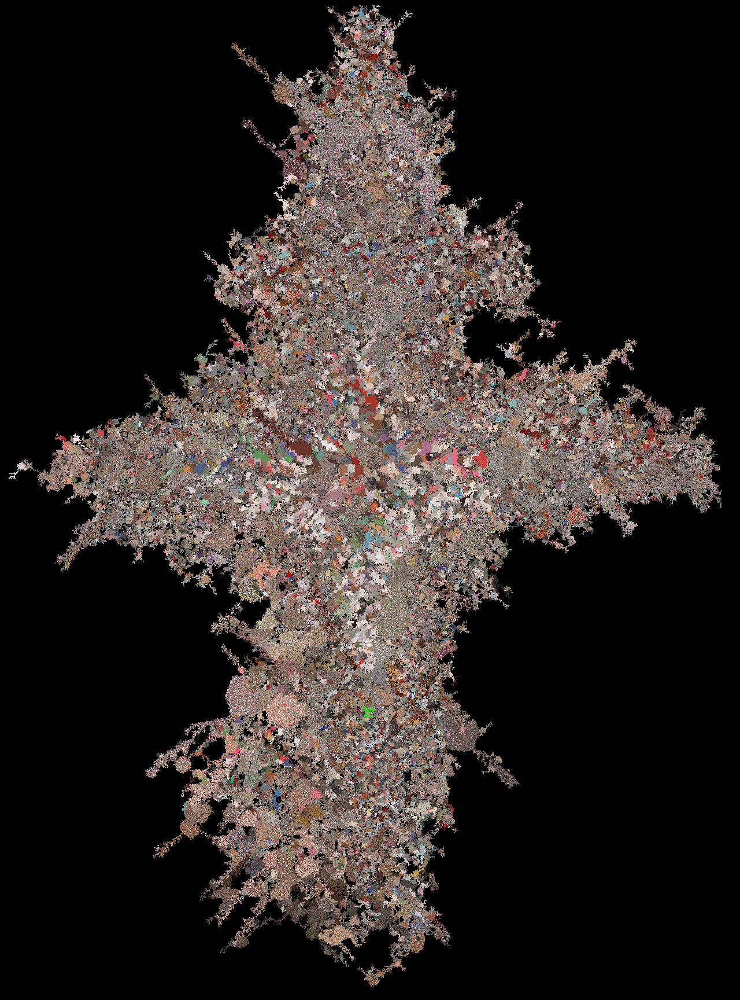

# Benefits

* Works with hundreds of thousands of images and videos **at the same time**
* Tested with around 700.000 images (see the world map shown here), that's a RuGiVi Pixel size of 4.600.000 x 4.400.000 pixels or 20.240.000 Megapixels or 10.120.000 Full HD Screens to be scrolled through
* Dynamic view rendering - screen is updated partially when drawing takes more time
* Thumbnails are cached in a database
* Video still frames are cached in a cache directory structure
* Works together with the [Fapel-System](https://github.com/pronopython/fapel-system)
* Uses PyGame to render everything
* With some tweaks it should work under MacOS (but was not tested)


# Requirements

* Microsoft Windows or Ubuntu Linux (was written on Ubuntu, should work on all big distros). Works probably on MacOS when tweaked
* 8 GB RAM or more
* Python 3
* PIP Python Package Manager
* VLC is recommended for video playback


# Installation

## Ubuntu Linux Installation

Install python tkinter and pillow

	```bash
	sudo apt-get install python3-tk python3-pil.imagetk
	```

install RuGiVi via pip, run

	```bash
	pip install rugivi
	```
and start RuGiVi

	```bash
	rugivi
	```

RuGiVi will open up its configurator at the first start, see [Configure RuGiVi](#configure-rugivi).

## Windows Installation

Download and install Python 3: [https://www.python.org/downloads/windows/](https://www.python.org/downloads/windows/)

Open a command window (press Windows+R then type cmd.exe and start it)

Type and run

	```
	pip install rugivi
	```

after that start rugivi, in the command window run:

	```
	rugivi
	```

RuGiVi will open up its configurator at the first start, see [Configure RuGiVi](#configure-rugivi).
You can create start menu entries with the configurator.

# Configure RuGiVi

After starting rugivi for the first time, you must configure the locations of various files.

If you want to get started and just run RuGiVi, just change the blue entries!

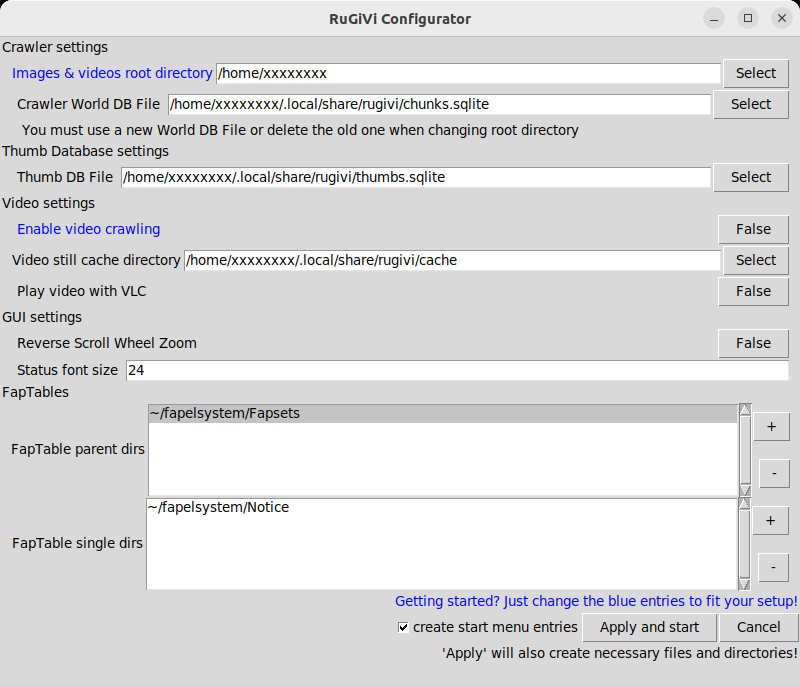

|Setting      | Description                                                                              |
|-----------------|------------------------------------------------------------------------------------|
|Images & videos root directory| This is the root directory of all the pictures and videos you want to explore within RuGiVi |
|Crawler World DB File | This is the database file the "world" (the position of all files on the screen) is saved to|
|Thumb DB File| The Database containing all thumbnails. *This can be several GB in size!*|
|Enable video crawling|When "true", RuGiVi will also parse video files|
|Video still cache directory| The directory where RuGiVi will save video still frames as jpg images|
|Play video with VLC| When "true", RuGiVi will try to use VLC as the video player when opening a video by pressing `n`. Otherwise it will use the system default video player.|
|Reverse Scroll Wheel Zoom| Changes the direction for zooming. Set it "true" when using a trackpad|
| Status font size | Font size of the grey status area|
| FapTable parent dirs | See FapTables |
| FapTable single dirs | See FapTables |
| create start menu entries | Check if you want to have RuGiVi as icon in your start menu |

> :cherries: *You must use a new World DB File or delete the old one when changing root directory*

> :cherries: *rugivi_configurator migrates your old config file when you upgrade from a previous version of RuGiVi. Make sure to press "Apply and exit" even when you do not change settings yourself!*

Make sure your database files are placed on a SSD drive!

To open the configurator again later, open a terminal / command window (under Windows press Windows+R then type cmd.exe and start it) and run

```
rugivi_configurator
```

# Start RuGiVi

You can start RuGiVi via the start menu entry.

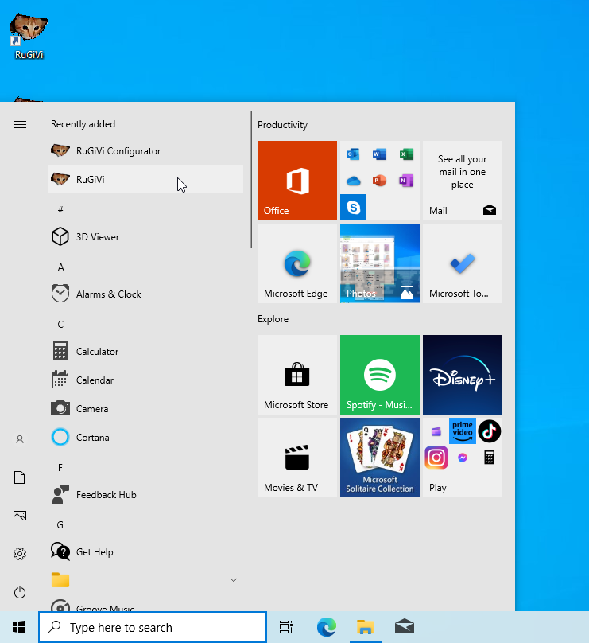

or via console / command window, just run:

	```
	rugivi
	```

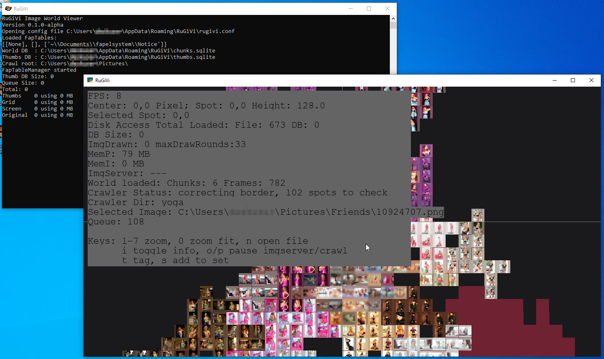

RuGiVi opens with an additional terminal window showing some log.

You now want to maximise the main window.

You can toggle the grey info box by pressing `i` repeatly.

Rugivi will now recursivly travel trough your directory tree and gather all images with all thumbs.

You can watch this process or start traveling through the images world.


# Commands


|Key/Button       |Action                                                                              |
|-----------------|------------------------------------------------------------------------------------|
|Left Click       |Select an Image                                                                     |
|Right Click      |Center clicked area                                                                 |
|Hold Left        |Move world                                                                          |
|Double Click Left|Open / Close Preview when zoomed out                                                |
|Wheel            |Zoom in / out                                                                       |
|Click Wheel      |Fapel Table Edit Mode on / off                                                      |
|i                |Toggle grey information box                                                         |
|1-7              |Zoom levels                                                                         |
|0                |Zoom fit                                                                            |
|j                |Jump randomly                                                                       |
|n                |Open image with system image viewer; Open video with system video player of VLC     |
|t                |Call [Fapel-System](https://github.com/pronopython/fapel-system) Tagger on selection|
|s                |Call [Fapel-System](https://github.com/pronopython/fapel-system) Set on selection   |
|up / down        |Open and go through Fapel Table rows                                                |
|left / right     |Go through Fapel Tables of one row                                                  |
|g                |Open Dialog to go to a spot by coordinates x,y                                      |
|c                |Open information dialog  |
|o                |Pause image server (troubleshooting)                                                |
|p                |Pause crawler (troubleshooting)                                                     |
|e                |Generate and export world map as png file                                           |

To make `t` and `s` work, you must have the fapel-system installed and make sure, that the correct python executable is set in RuGiVis config file (this should work out of the box for Ubuntu and Windows but I could not check all possibilities).


# Quitting RuGiVi

Close RuGiVi by closing the main window ("x"). If it works and all databases and jobs can be successfully exited, the window closes after a few seconds and the commandline returns to the prompt.

Sometimes RuGiVi hangs up during shutdown (a known bug). If so, please go into the command line and kill RuGiVi with Ctrl+C.

# Video handling

If you have video crawling enabled through rugivi_configurator, RuGiVi will parse video files and add them as a set of video still frames to your world map.

RuGiVi supports mp4, mkv, webm, mov, rm, avi, flv, wmv and asf video files.

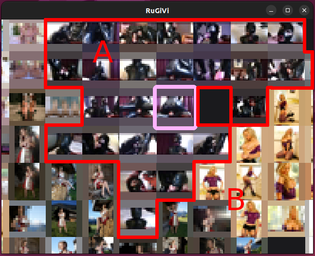

Here a video is represented by video frames (A) which will be generated by RuGiVi and placed anlongside normal images (B).


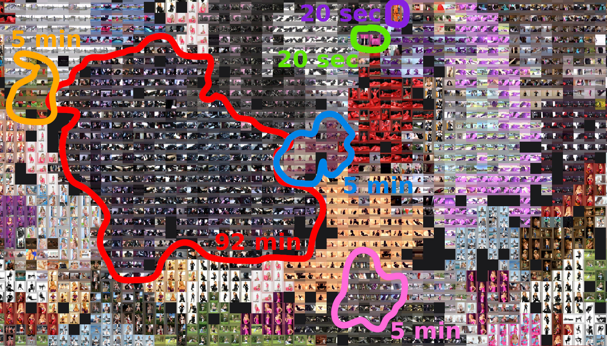

Different video length result in different amount of images. RuGiVi tries to at least get 2 images (20 seconds videos / reels / shorts in the above example). Longer videos get at least 1 frame every 15 seconds. The 92 minutes video in the example above results in about 360 images.

| Duration | images |
|-------|------|
| few seconds | 2 |
| 30 sec | 3 |
| 1 min | 4 |
| 2 min | 8 |
| 5 min | 20 |
| 10 min | 40 |
| 30 min | 120 |
| 60 min | 249 |
| 90 min | 360|

## Playback via standard app or VLC media player

If you open a video by pressing `n`, RuGiVi opens it in your standard video player.

The video will start from the beginning, no matter which still frame you selected:

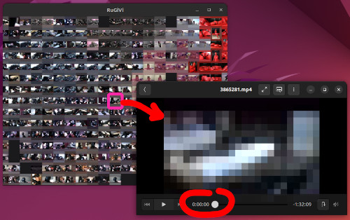

If you have the [VLC media player](https://www.videolan.org/vlc/) installed, you can enabled VLC playback in rugivi_configurator. RuGiVi will then open up VLC for playback and seek the video to 2 seconds before the frame you selected:

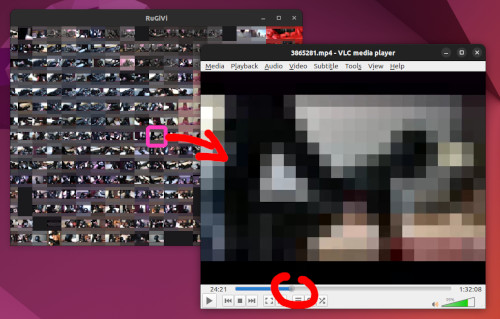

You can switch off the seeking feature via RuGiVi config file (not supported by the configurator).

## Remove Letterbox

RuGiVi removes black borders ("Letterbox") around video frames by default.

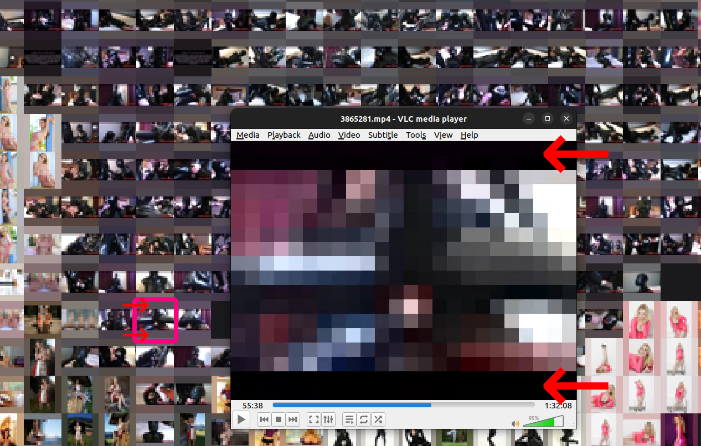

In this example all small images of this video within RuGiVi have no black stripes on top and bottom whereas the video itself has these black letterbox stripes.

You can switch off this removal of black borders in RuGiVi config file (not supported by the configurator).


# Information dialog

Pressing `c` while a file is selected brings up an information dialog about that file:

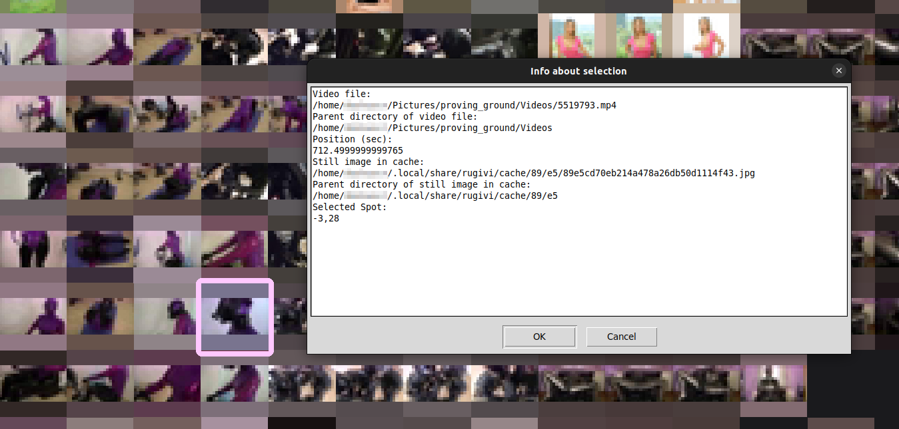

The information dialog is especially handy if you want to copy and paste directory or filename information of your selection. Just select the text you want to copy and use the right click menu to copy the text to your clipboard.

| Information| Description|
|--|--|
|Image file| the original image|
|Video file| the video file the still image you selected in RuGiVi was taken from|
|Parent directory of image/video file| the directory without the filename|
| Position (sec)| the video position in seconds of the selected still image|
|Still image in cache| the path and filename of the still image RuGiVi uses (the location in the cache)|
|Parent directory of still image in cache | the directory without the filename of the still image (the cache sub directory)|
|Selected Spot| the x,y coordinates of the selected spot|
|Ordered Quality|The needed quality to display the picture. Image Server will fetch this quality. (0 Thumb, 1 Grid, 2 Screen, 3 Original)|
|Available Quality|The current loaded quality in memory|
|State| Image Server's state of this image|

# FapTables

FapTables are a way to always keep specific media in the view floating over the world view all the time.

Here you can see the red catsuit images floating over the world view. When the world view is moved, the images stay at that position on the screen:

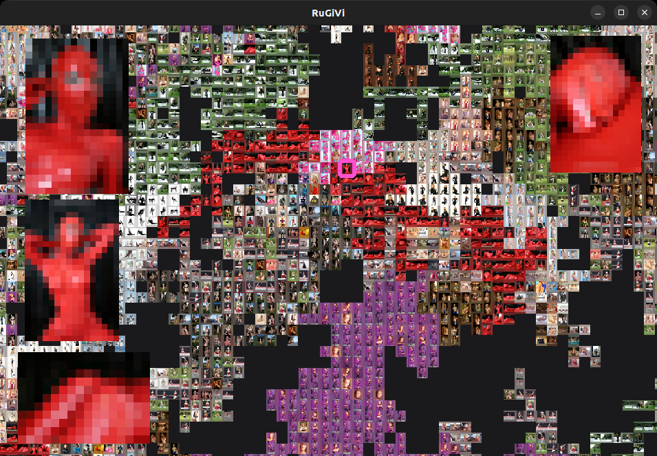

You can have more than one of these "tables" or "desk". And you can rearrange the images via the Fapel Table Edit Mode (pressing the mouse wheel).


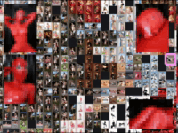

One table equals one directory you specify in the RuGiVi Configurator. This is the directory that was presented as the fapel table above:

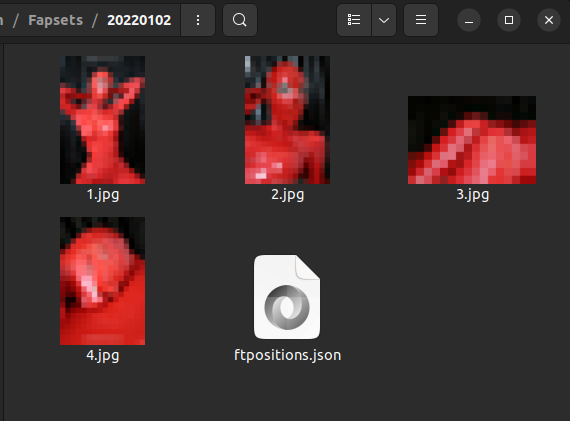

It contains all the media and a file called ftpositions.json, which RuGiVi saves the positions of the images on screen.


## Fapel Table Edit Mode

The images are not arranged when you open a new Fapel Table or when new images are added:

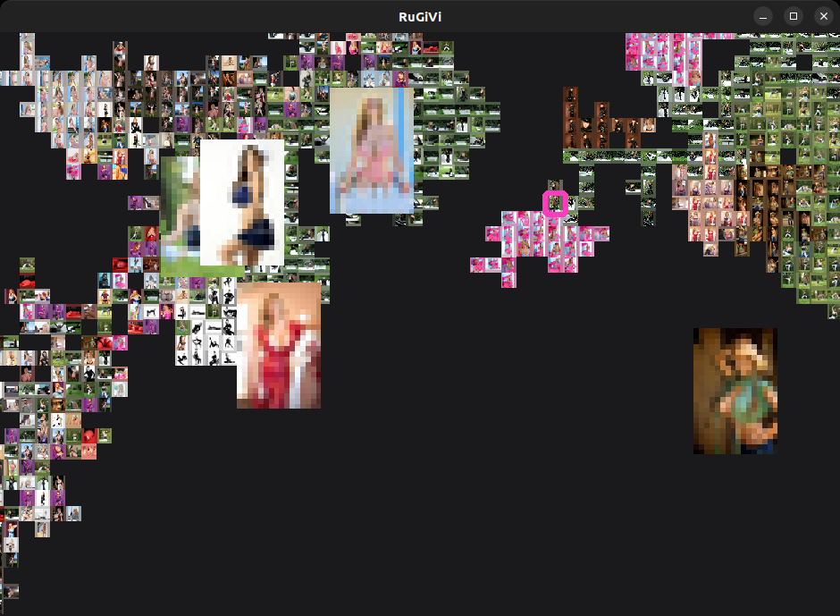

Press wheel button / middle mouse button to enter the edit mode:

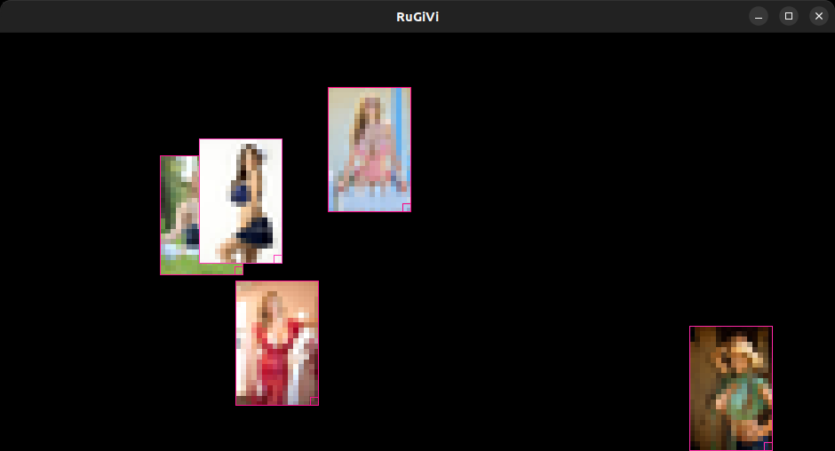

Now drag images to your fav position and resize them (drag rectangle at bottom right corner of an image):

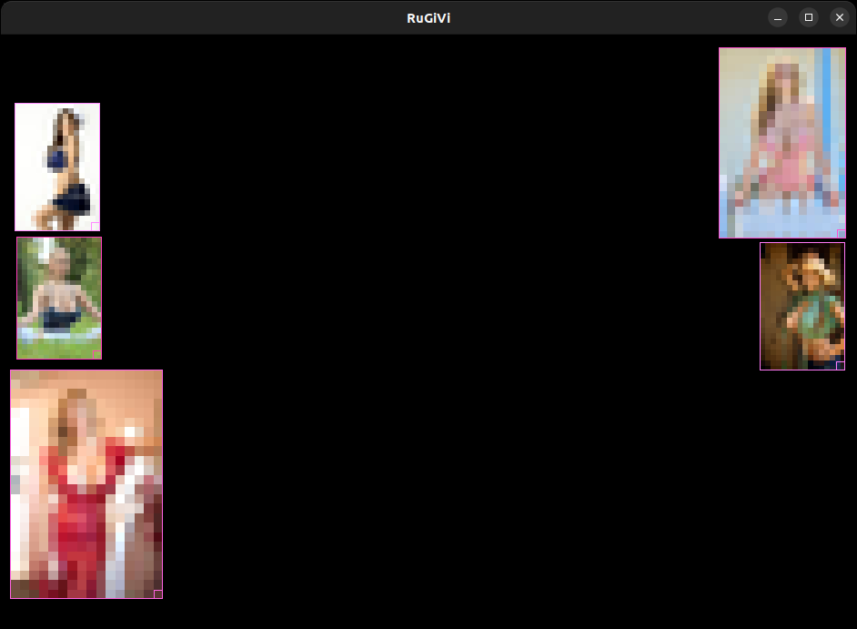

Switch back to explorer mode by pressing wheel / middle mouse button again:

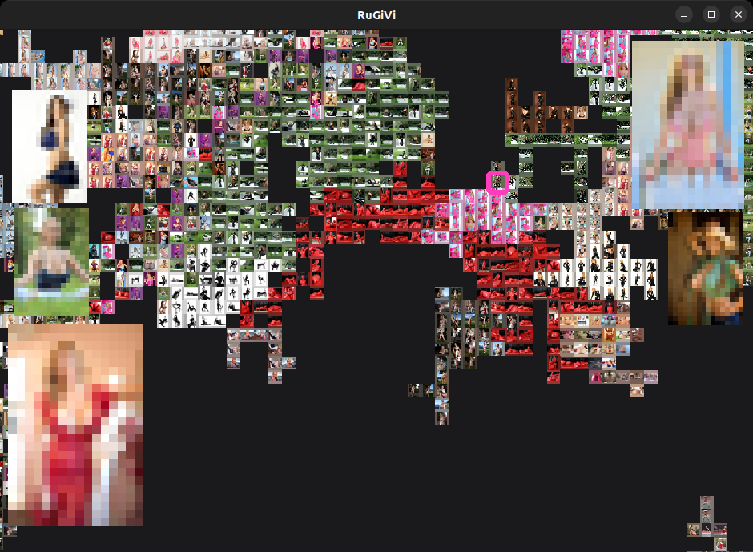


## Switching between Fapel Tables


You can switch between different Fapel Tables with the cursor keys.
You start at the top "(off)" (no fapel table is presented) and when you press down, you get the first fapel table created from the first subdir of the first parent dir you specify in the configurator.

In this example pressing "down" gets you into the dir "20220101" from the parent directory "Fapsets" you specified in the configurator under "FapTable parent dirs":

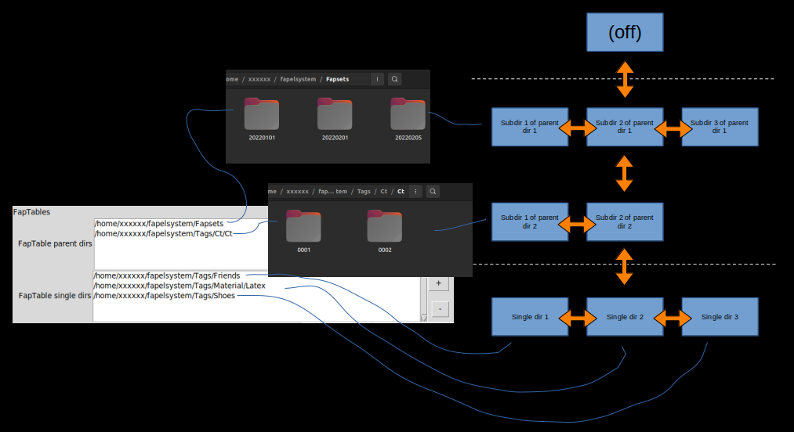

Switch between all subdirs by pressing left and right arrow keys.

In the example, pressing right opens faptable from directory 20220201.


Pressing further down switches through all subdirs of all parent dirs.

In the example, pressing down gets you to 0001 of the Ct parent dir.

The last set of directories are the "single dirs" where all the directories are presented next to each other.


## Switching off Fapel Tables

To switch off the display of fapel tables just press "up" arrow key until you reach "(off)" so no fapel table is presented.


# Export World Overlook / World Map

You can generate an image file where every pixel represents one image on the world map of RuGiVi.


RuGiVi testing world map. You can clearly see that I used the same (hardlinked) images again and again to generate a 75000 picture directory tree.

**75,000 images** (1 pixel = 1 image)


Real map of a collection of individual pictures and picture sets with around 700,000 pictures total. You can clearly see sets (same color) and folders with single random pictures.

**700,000 images** (1 pixel = 1 image)


Press `e` to open up a filename dialog. Specifiy a place and a name for your map `.png` image file.

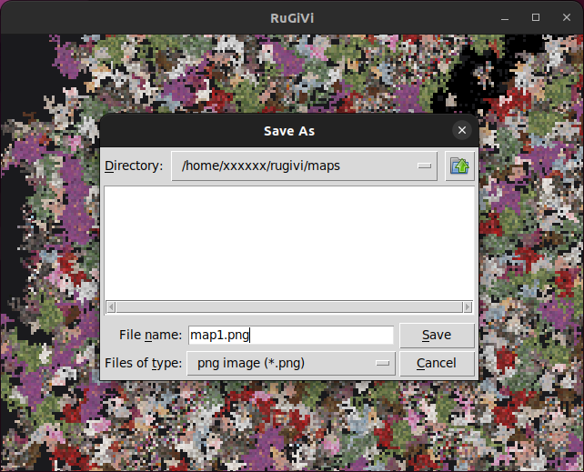

RuGiVi will then start to load all thumbnail / color information and place one pixel per image on the png file.

Do not wander around in RuGiVi while the map is generated.

Press `i` to show the information display. It will tell you how many thumbs are left to load:

`World Overlook: Remaining Thumbs: x`

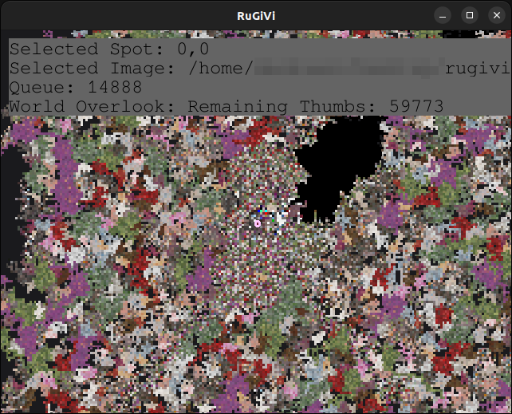

Note that the image loader queue is constantly filled and emptied while generating the map. RuGiVi will save the png with what has been loaded already every few seconds while generating the map.

It will also tell you, when your map image is finished:

`World Overlook: finished`

It is advised to restart RuGiVi afterwards.

You will need 1 GB of RAM for every 150,000 images in your world.

Note that you can only run World Overlook one time per RuGiVi Session. You need to restart RuGiVi, if you want to export another map.


# Exclude directories from crawling

You can edit RuGiVi's config file to exclude subdirectories of the root directory from crawling:

```
crawlerRootDir=/my/root/dir
crawlerExcludeDirList=/my/root/dir/DoNotCrawl;/my/root/dir/No access here
```

Multiple directories are seperated with a `;`.

> :cherries: *This feature is currently not supported by the configurator. You have to edit the config manually.*


# Tips

* Speed up loading thumbs and images from the Queue: The queue can easily reach 50000 pictures / thumbs at once when zooming out. Switching to FapelTable by pressing middle mousebutton stops the drawing of the world

* You can speed up everything by using a fast SSD and a lot of RAM. When running inside a virtual machine make sure the machine has enough virtual processors, a lot of RAM and its disk files are on SSDs.

# Troubleshooting

|Problem        |Solution                                                     |
|---------------|-------------------------------------------------------------|
| RuGiVi does not start| Try starting RuGiVi via console (with `rugivi`) and look at the error messages. Common reasons is a broken or incorrect config file. You can also try to define new world and thumb database files.|
|Screen is black|Probably Edit mode is enabled, press middle mousebutton again|
|Images are pixelated or just red    | RuGuVi is probably loading a lot of images and the ones you currently want to see are at a later position at the loader queue. Keep an eye on "Queue" in the information box (                                                       press `i` to show it) |
|Images stay red even after waiting|When the original file is an image, the image is missing. If it is a video, the cache file is missing or the cache is broken.|
|RuGiVi is slow               |   Loading takes time and RuGiVi loads a lot of data. See the Tips section for speed tips. |
|Fapel-System keys (t and s) crash RuGiVi, despite the Fapel-System being installed      |   Check RuGiVi Config file if the correct python executable is mentioned under section `[control]`, `pythonexecutable=` |
|Crash and `FileNotFoundError: [Errno 2] No such file or directory: 'vlc'` when pressing `n`| You have playback via VLC enabled but it is not installed or the path to vlc binary (vlc.exe on Windows) is wrong. Change vlc binary path in rugivi.conf|
|Config entry missing! Error: The following group / key combination is missing in your RuGiVi config... | The shown config entry is missing in your config file. Please add it manually in your rugivi.conf. Look into rugivi dir of git repo for a default config file. You can also run `rugivi_configurator` to add missing entries.|

## Debug video still generation and playback

In the config file you can enable verbose output of CV2 (which is used for video still generation) and VLC (which plays back videos):

```
[debug]
vlcverbose=True
cv2verbose=True
```

## Known bugs and limitations
* Quit does not work everytime. The crawler then runs in an infinite loop.
* Sometimes the garbage collection is not run or runs too late and memory is depleted (rugivi can easily grab gigabytes of RAM of course). You then get an out-of-memory error.
* Despite not changing anything, RuGiVi does not work on read-only media directories. This is because pygame image loader opens files with write access.
* TIFF files may produce warnings which on Windows are opened as separate message boxes.
* Audio pops at startup (probably a pygame issue)
* High res versions are unloaded despite being displayed (pictures end up showing as a colored square when zoomed beyond thumb size)

# Technical Stuff

Every Image is placed into a Frame with Spot Size of 4096 x 4096 Pixels, which is Heigth = 1

A Frame is placed onto a spot.

Spots are grouped into chunks. Every Chunk contains 32 x 32 = 1024 Spots (and thus, a maximum of 1024 images)

RuGiVi has its own garbage collection which is called "housekeeping" which runs every 5 minutes.

## Variable and attribute naming convention within the code

| Postfix | Address Mode | Explanation |
|-----|----|----|
| _P | pixel | pixel address in world or with +L locally on screen |
| _S | spot | one spot represents a 4096 x 4096 pixel surface for an image  |
| _C | chunk | A chunk consists of a matrix of 32 x 32 spots |
| _CS | chunk and spot | tupel address with chunk, then spot |
| +L | local address | _PL then means e.g. pixel on screen, _SL means spot within a chunk |

A spot is the place where a frame with an image is placed. This is differentiated to allow bigger frame sizes (e.g. 2x2 spots) in future versions.

## Sizes of images kept in RAM

The code and the gui refer to different sizes an image can have. Different sizes are kept in RAM and discarded to free memory when the image is not drawn for a longer period of time.


| Quality | Abbreviation | QUALITY_PIXEL_SIZE |
| ----|-----|-----|
| Color | C | just average color (R,G,B) over all pixels |
|Thumb| T| 32 x 32|
|Grid | G | 128 x 128 |
| Screen | S | 1000 x 1000|
| Original | O | full size of media file |

Each thumb needs around 3 to 6 kB of RAM, so for world map generation you will need 1 GB of RAM for every 150,000 images in your world.

## Disk space needed

### Database size
The thumbs.sqlite file will use the following disk space depending on your world size.

| Number of images | approx. thumb db size |
| ----|-----|
|10.000 | 47 MB|
|50.000 | 236 MB|
|200.000 | 1 GB|
|500.000 | 2.3 GB|
|700.000 | 3.3 GB|
|1.000.000 | 4.7 GB|

The chunks.sqlite will stay around 100 MB.

A video file will gegenerate approximatly 4 images per minute.

### Video still frame cache size

| jpg quality | maxsize | MB / 1000 video still frame images | MB / 1000 videos| |
|--|--|--|--|--|
| 65 | 800 | 11.4 | 321 | |
| 65 | - | 16.6 | 467 | default |
| 75 | - | 19.5 | 548 | |
| 95 | 800 | 27.4 | 771 | |
| 95 | - | 46.9 | 1318 | |

Note that the "*MB / 1000 videos*" column contains my personal experience with my video collection (broad mix of short and long, small and Full-HD videos). If you have tenthousand 4k videos your milage may vary.

You can change the video still image quality manually in RuGiVi config. Just see further down how to do this.

## Video still frame cache


### Cache design
When you configure a directory as the video still cache in rugivi_configurator, RuGiVi uses it as the base directory for sub directories to store the video still frames in it.

Every frame you see in the RuGiVi landscape will then be a jpg image file within the cache.

The typical content of one of the cache directories then looks like this:

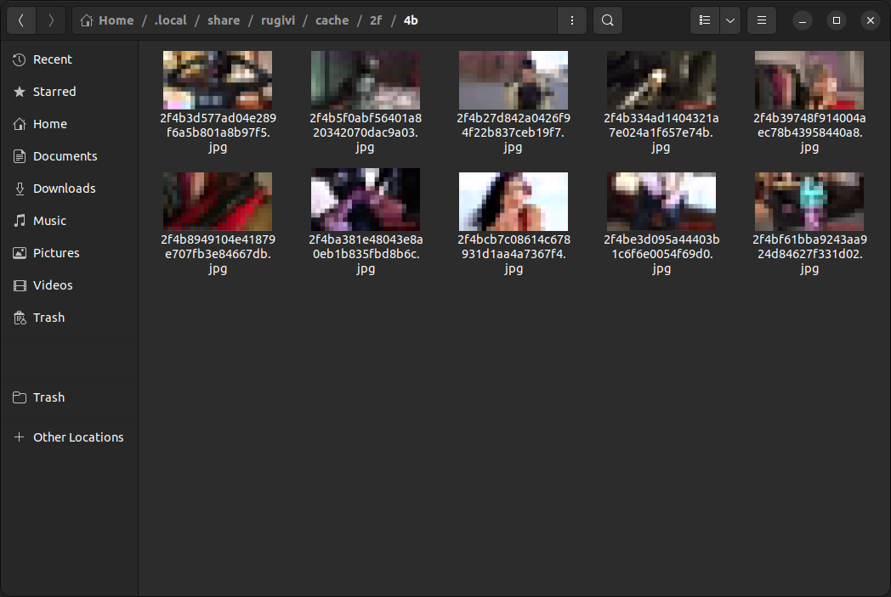

Since all still frames are stored by random names and in random cache folders, every folder contains random still frames.

> :eggplant: :sweat_drops: *Note: The files within the cache are plain normal jpg images of your beloved videos. So just be aware that the cache contains this content!*

### Cache image quality settings

Via the config file you can manually edit and set the quality of the generated still video frames:

```
[videoframe]
jpgquality=65
maxsizeenabled=False
maxsize=800
```
| Setting | Description|
|--|--|
|jpgquality| The jpg quality in the typical range from 0 (lowest) to 100 (highest). Recommended is 55-95.|
|maxsizeenabled| When set to "True" then RuGiVi will scale down video still frames when they exceed the maxsize value.|
|maxsize| The size in pixel a video frame is scaled down to (height and width)|

Note that changed settings only affect newly generated images.


### Cache Maintenance

When you create a new database and do not delete the cache or when RuGiVi crashes without saving the last changes, video still frame image files will remain unused and orphaned in the cache.

RuGiVi comes with a small commandline tool to clean up the cache.

When you are **not running RuGiVi**, run

`rugivi_image_cache_maintenance`

to gather information about the cache status (*nothing will be changed yet!*):

```
Opening config file /home/xxxxxxx/.config/rugivi.conf
Reading Chunks from Database:done
Scanning files of cache:done
Gathering information on files in cache:done
World DB files: 1000
Cache files   : 1530
Cache size: 60 MB
Finding orphant cache files:done
Orphant files : 530
NOTHING WAS CHANGED YET!
RUN THIS TOOL AGAIN with '-c' to move orphant files and clean up the cache!
```

In this example 530 of 1530 files can be deleted.

Run it again with the parameter `-c` to actually clean the cache:

`rugivi_image_cache_maintenance -c`

All orphant files will be moved to a `trash_` directory:

```
530 file(s) moved to trash: /xxxx/xxxxx/rugivi_cache/trash_20240101_120000
Check these files if they are ok to be deleted and then delete the 'trash_*' folder manually.
```

You can now go to the mentioned directory and check and delete the orphaned files manually.

> :cherries: *No files are deleted by this tool itself! This is a precaution because the tool also has access to your image and video collection.*

If you get a 

`Warning: There is already a trash folder present: /.../.../trash_20240101_120000`

the maintenance tool reminds you that there is already a trash folder present which might take up disk space.


## Information display

Press `i` a few times to show the information display.


|Info        | Description                                                    |
|------------|----------------------------------------------------------------|
|FPS         |Frames per second                                               |
|Center Pixel  | Your current position is shown in x/y Pixels and Spots|
| Center Spot | Your current position in x/y spot coordinates. This are the values you can use with the go-to option pressing `g`|
|Height| Zoom height|
|Selected Spot| The Spot highlighted with selection. Again you can use these coordinates with the go-to option pressing `g`|
|Disk Access Total Loaded| How many times had an image/media file been loaded from disk ("File") or as a thumbnail from the thumb database ("DB")|
|DB Size| Number of images in the thumb database|
|ImgDrawn| Drawn images on screen|
|maxDrawRounds|How many drawing rounds per Frame|
|MemP|Used memory reported by OS ("Process memory")|
|MemI|Used memory only for images calculated by RuGiVi's Image Server ("Image server memory")|
|ImgServer| Images in memory: T=Thumb Size, G=Grid Size, S=Screen Size, O=Original (Full) Size|
|World loaded| How many chunks and frames are in memory|
|Crawler Status| saving to db = DB is written do disk, sleeping = so the crawler does not eat all process power, correcting border = creating the border around the newly fetched frames/spots, fetching next dir = scanning dir, finding biome = finding a place in the world for all media of the scanned dir
|Crawler Dir| The current directory which is scanned|
|Selected Image| The currently selected image|
|Queue| Image Server Queue (both Disk and DB access)|
|World Overlook|Only displayed when a map is being generated. Shows the status of the generation process.|

## Crawler World Building Customization

You can customize how the world is layed out via settings in rugivi.conf (not supported via rugivi_configurator).

| Setting |Default| Description |
|---|---|--|
|crossshapegrow| `False`|`True` = Shape world like a cross. `False` = Shape world like a ball. Earlier versions of RuGiVi had a bug that resulted in a world shaped like a cross / plus sign instead of a round world.|
|nodiagonalgrow| `True`| `True` = Pictures of a set a placed only top/bottom/left/right, never diagonal.|
|organicgrow| `True`| `True` = Picture sets are more sponge-like|
|reachoutantmode| `True`| `True` = Sometimes sets are grown like a spike reaching out from the center|


## Backup database files and cache

If you want to backup your config and database files and the video still frame cache, just make a copy of these files and directories. If you did not change the location in the `rugivi_configurator`, then you find the files and directories here:


|file/dir     | Linux                 | Windows      |
|------------|---------------------|---------------------------|
|rugivi.conf     | ~/.config/               | C:\Users\\[username]\\AppData\Roaming\RuGiVi  |
|thumbs.sqlite    | ~/.local/share/rugivi/     | C:\Users\\[username]\\AppData\Roaming\RuGiVi  |
|chunks.sqlite    | ~/.local/share/rugivi/     | C:\Users\\[username]\\AppData\Roaming\RuGiVi  |
|video still frame cache directory| ~/.local/share/rugivi/cache | C:\Users\\[username]\\AppData\Roaming\RuGiVi\cache|


## Mockup images mode for testing and development

RuGiVi includes a feature for testing the crawler. If you enable

```
[debug]
...
mockupimages=True
```

in `rugivi.conf`, RuGiVi will not load images but rather represent every directory and every video file it finds with empty spots. Each directory and each video file will be represented by a different color. The world is build up faster without loading images.

# 📢 Community Support

The [GitHub discussion boards](https://github.com/pronopython/rugivi/discussions) are open for sharing ideas and plans for RuGiVi.

You can report errors through a [GitHub issue](https://github.com/pronopython/rugivi/issues/new).

Don't want to use GitHub? You can also contact me via email: pronopython@proton.me If you want to contact me anonymously, create yourself a burner email account.

# Release Notes

## v0.5.0-alpha

### added

- PyPi Support: RuGiVi can now be installed via pip (PyPi) directly

### changed

- rugivi starts rugivi_configurator if necessary (because of PyPi support)
- rugivi_configurator now creates a complete config file if necessary (because of PyPi support)
- rugivi_configurator creates start menu entries if desired (because of PyPi support)

## v0.4.1-alpha

### fixed

- install now requires specific versions of modules

## v0.4.0-alpha

### added

- Video file support including still frame cache and external playback for mp4, mkv, webm, mov, rm, avi, flv, wmv and asf video files
- Information dialog
- Subdirectories of the root directory can now be excluded from crawling
- Video still image cache maintenance cli tool
- mockup images mode for testing and development of crawler
- Crawler world building can be customized via config

### changed

- Crawler wait times optimized
- Smaller sizes and thumbs now use antialias scaling
- Images are shown down to 5 pixel width/height, color starts at 4 pixels

### fixed

- Crawler border correction bug (crawler is now faster)
- Surface draw crash when using peek
- View fetch loop for images bigger than thumb size even ran when zooming out to or smaller than thumb size. Zooming out with `7` now is faster.

## v0.3.1-alpha

### added

- RuGiVi Configurator: A red labeled warning that you must use a different World DB File or delete the old one when changig the root directory
- Animated "please wait" label showing as long as less than 10 pictures are loaded, because initial startup takes a few seconds and this especially puzzled new users since nothing was displayed.
- Some technical topics / troubleshootings in readme

### fixed

- missing Pillow / PIL dependency during setup (added as a manual step for Ubuntu and in setup.py)
- pressing Cancel in the root dir folder dialog crashed RuGiVi Configurator

## v0.3.0-alpha

### added

- World overlook / world map generation and export as a png file.


### changed

- Complete refactor of code base: formatted, cleaned, refactored meaningful variable names. Better for the author and everyone who wants to understand the code
- Faster image loading: Tweaked thread wait times and image loading sequence


