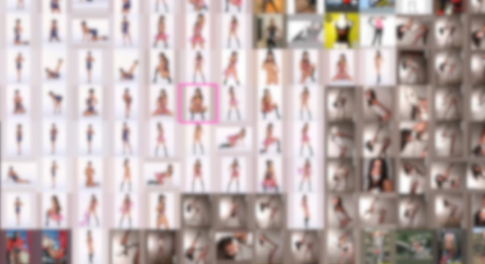
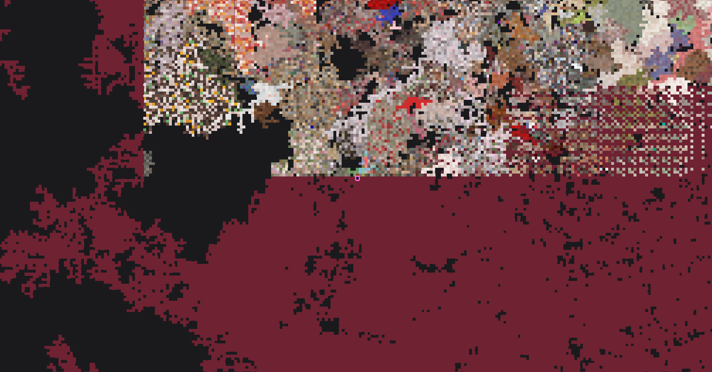

# RuGiVi - Adult media landscape browser

RuGiVi enables you to fly over your image collection and view thousands of images at once. Zoom in and out from one image to small thumbnails with your mousewheel in seconds. All images are grouped as you have them on your disk and arranged in a huge landscape. RuGiVi can work with hundred thousand of images at once.

RuGiVi integrates fully into the [Fapel-System](https://github.com/pronopython/fapel-system), so you can travel trough your collection and tag images as you fly over them!

Fly over thumbnails and zoom in on any image anytime in an instant!

> :eggplant: :sweat_drops: *Note: All sample images on this page are censored*

Image Landscape generation from your directory structure:

Zooming and wandering around:

Double click preview:

Always visible, floating Fapel Tables:

Zoom in (screenshot is obviously censored ;-) )

And zoom out

Left doubleclick enables a peepy preview.
Every rectangle is one image which you can zoom into.
Images within one directory are always placed randomly next to each other in an organic fashion. You also clearly can see different image directories: Ones which contain a mix of different images (random colors) and ones with one photo set (uniform color).

RuGiVi saves all generated thumbnails in a database and can load these on the fly at the next session.
Here you can see chunks (rectangular blocks of 32 x 32 pictures) being loaded from thumb database (on this system at around 800-1000 thumbs per second).
The pattern like structure between pictures and red empty spots on the right is RuGiVis dynamic screen update mechanism, which favors pattern like update and tearing over broken fps.

You can also export a world map:

**World with 75,000 images** (1 pixel = 1 image)

**World with 700,000 images** (1 pixel = 1 image)

# Benefits

* Works with hundreds of thousands of images **at the same time**
* Tested with around 700.000 images (see the world map shown here), that's a RuGiVi Pixel size of 4.600.000 x 4.400.000 pixels or 20.240.000 Megapixels or 10.120.000 Full HD Screens to be scrolled through
* Dynamic view rendering - screen is updated partially when drawing takes more time
* Thumbnails are cached in a database
* Works together with the [Fapel-System](https://github.com/pronopython/fapel-system)
* Uses PyGame to render everything
* With some tweaks it should work under MacOS (but was not tested)

# Requirements

* Microsoft Windows or Ubuntu Linux (was written on Ubuntu, should work on all big distros). Works probably on MacOS when tweaked
* 8 GB RAM or more
* Python 3
* PIP Python Package Manager

# Installation

## Ubuntu Linux Installation

### 1. Clone this repository

Clone this repository into a writeable directory.

### 2. Install python tkinter

`sudo apt-get install python3-tk`

### 3. Install RuGiVi via pip

In the repo's root run

`chmod +x install_ubuntu.sh`

`./install_ubuntu.sh`

It installs RuGiVi via Python's PIP and creates start menu entries.

> :cherries: *Do not run the install_ubuntu.sh as root (sudo), as it would create config files for root user and not for you*

### 4. Configure RuGiVi

Proceed with [Configure RuGiVi](#configure-rugivi) (you need to do this!)

## Ubuntu Linux Upgrade

If you upgrade from a previous version of RuGiVi, follow these steps.

Note that it is advised to backup your databases (see further below).

### 1. Clone this repository

Clone this repository into a writeable directory.

### 2. Uninstall old version with pip

Run

`pip uninstall rugivi`

to uninstall the old version, but leave config file and database intact.

### 3. Install RuGiVi via pip

Run

`pip uninstall .`

in the repository root (the one containing the `setup.py` file)

## Windows Installation

### 1. Clone or download this repo

Yes, clone or download this repo now!

### 2. Install Python

Download and install Python 3

[https://www.python.org/downloads/windows/](https://www.python.org/downloads/windows/)

### 3. Install RuGiVi via pip

Start (doubleclick) `install_windows.bat`

It installs RuGiVi via Python's PIP and creates the start menu entries.

### 4. Configure RuGiVi

Proceed with [Configure RuGiVi](#configure-rugivi) (you need to do this!)

## Windows Upgrade

If you upgrade from a previous version of RuGiVi, follow these steps.

Note that it is advised to backup your databases (see further below).

### 1. Clone this repository

Clone this repository into a writeable directory.

### 2. Run upgrade batch file

Doubleclick

`upgrade_windows_installation.bat`

to uninstall the old version, but leave config file and database intact and then automatically install the new version.

# Configure RuGiVi

Run `rugivi_configurator`:

Change the entries to fit your setup.

|Setting      | Description                                                                              |
|-----------------|------------------------------------------------------------------------------------|
|Crawler root directory       | This is the root directory of all the pictures you want to explore within RuGiVi |
|Crawler World DB File | This is the database file the "world" (the position of all files on the screen) is saved to|
|Thumb DB File| The Database containing all thumbnails. *This can be several GB in size!*|
|Reverse Scroll Wheel Zoom| Changes the direction for zooming. Set it "true" when using a trackpad|
| Status font size | Font size of the grey status area|
| FapTable parent dirs | See FapTables |
| FapTable single dirs | See FapTables |

Make sure your database files are placed on a SSD drive!

# Start RuGiVi

You can start RuGiVi via the start menu entry.

RuGiVi opens with an additional terminal window showing some log.

You now want to maximise the main window.

You can toggle the grey info box by pressing `i` repeatly.

Rugivi will now recursivly travel trough your directory tree and gather all images with all thumbs.

You can watch this process or start traveling through the images world.

# Commands

|Key/Button       |Action                                                                              |
|-----------------|------------------------------------------------------------------------------------|
|Left Click       |Select an Image                                                                     |
|Right Click      |Center clicked area                                                                 |
|Hold Left        |Move world                                                                          |
|Double Click Left|Open / Close Preview when zoomed out                                                |
|Wheel            |Zoom in / out                                                                       |
|Click Wheel      |Fapel Table Edit Mode on / off                                                      |
|i                |Toggle grey information box                                                         |
|1-7              |Zoom levels                                                                         |
|0                |Zoom fit                                                                            |
|j                |Jump randomly                                                                       |
|n                |Open image with system image viewer                                                 |
|t                |Call [Fapel-System](https://github.com/pronopython/fapel-system) Tagger on selection|
|s                |Call [Fapel-System](https://github.com/pronopython/fapel-system) Set on selection   |
|up / down        |Open and go through Fapel Table rows                                                |
|left / right     |Go through Fapel Tables of one row                                                  |
|g                |Open Dialog to go to a spot by coordinates x,y                                      |
|o                |Pause image server (troubleshooting)                                                |
|p                |Pause crawler (troubleshooting)                                                     |
|e                |Generate and export world map as png file                                           |

# Quitting RuGiVi

Close RuGiVi by closing the main window ("x"). If it works and all databases and jobs can be successfully exited, the window closes after a few seconds and the commandline returns to the prompt.

Sometimes RuGiVi hangs up during shutdown (a known bug). If so, please go into the command line and kill RuGiVi with Ctrl+C.

# FapTables

FapTables are a way to always keep specific media in the view floating over the world view all the time.

Here you can see the red catsuit images floating over the world view. When the world view is moved, the images stay at that position on the screen:

You can have more than one of these "tables" or "desk". And you can rearrange the images via the Fapel Table Edit Mode (pressing the mouse wheel).

One table equals one directory you specify in the RuGiVi Configurator. This is the directory that was presented as the fapel table above:

It contains all the media and a file called ftpositions.json, which RuGiVi saves the positions of the images on screen.

## Fapel Table Edit Mode

The images are not arranged when you open a new Fapel Table or when new images are added:

Press wheel button / middle mouse button to enter the edit mode:

Now drag images to your fav position and resize them (drag rectangle at bottom right corner of an image):

Switch back to explorer mode by pressing wheel / middle mouse button again:

## Switching between Fapel Tables

You can switch between different Fapel Tables with the cursor keys.
You start at the top "(off)" (no fapel table is presented) and when you press down, you get the first fapel table created from the first subdir of the first parent dir you specify in the configurator.

In this example pressing "down" gets you into the dir "20220101" from the parent directory "Fapsets" you specified in the configurator under "FapTable parent dirs":

Switch between all subdirs by pressing left and right arrow keys.

In the example, pressing right opens faptable from directory 20220201.

Pressing further down switches through all subdirs of all parent dirs.

In the example, pressing down gets you to 0001 of the Ct parent dir.

The last set of directories are the "single dirs" where all the directories are presented next to each other.

## Switching off Fapel Tables

To switch off the display of fapel tables just press "up" arrow key until you reach "(off)" so no fapel table is presented.

# Export World Overlook / World Map

You can generate an image file where every pixel represents one image on the world map of RuGiVi.

RuGiVi testing world map. You can clearly see that I used the same (hardlinked) images again and again to generate a 75000 picture directory tree.

**75,000 images** (1 pixel = 1 image)

Real map of a collection of individual pictures and picture sets with around 700,000 pictures total. You can clearly see sets (same color) and folders with single random pictures.

**700,000 images** (1 pixel = 1 image)

Press `e` to open up a filename dialog. Specifiy a place and a name for your map `.png` image file.

RuGiVi will then start to load all thumbnail / color information and place one pixel per image on the png file.

Do not wander around in RuGiVi while the map is generated.

Press `i` to show the information display. It will tell you how many thumbs are left to load:

`World Overlook: Remaining Thumbs: x`

Note that the image loader queue is constantly filled and emptied while generating the map. RuGiVi will save the png with what has been loaded already every few seconds while generating the map.

It will also tell you, when your map image is finished:

`World Overlook: finished`

It is advised to restart RuGiVi afterwards.

You will need 1 GB of RAM for every 150,000 images in your world.

Note that you can only run World Overlook one time per RuGiVi Session. You need to restart RuGiVi, if you want to export another map.

# Troubleshooting

|Problem        |Solution                                                     |
|---------------|-------------------------------------------------------------|
| RuGiVi does not start| Try starting RuGiVi via console (with `rugivi`) and look at the error messages. Common reasons is a broken or incorrect config file. You can also try to define new world and thumb database files.|
|Screen is black|Probably Edit mode is enabled, press middle mousebutton again|
|Images are pixelated or just red    | RuGuVi is probably loading a lot of images and the ones you currently want to see are at a later position at the loader queue. Keep an eye on "Queue" in the information box (                                                       press `i` to show it) |
|RuGiVi is slow               |   Loading takes time and RuGiVi loads a lot of data. See the Tips section for speed tips. |                                                          |
|               |                                                             |

# Tips

* Speed up loading thumbs and images from the Queue: The queue can easily reach 50000 pictures / thumbs at once when zooming out. Switching to FapelTable by pressing middle mousebutton stops the drawing of the world

* You can speed up everything by using a fast SSD and a lot of RAM. When running inside a virtual machine make sure the machine has enough virtual processors, a lot of RAM and its disk files are on SSDs.

# Known bugs and limitations
* Quit does not work everytime. The crawler then runs in an infinite loop.
* Sometimes the garbage collection is not run or runs too late and memory is depleted (rugivi can easily grab gigabytes of RAM of course). You then get an out-of-memory error.
* Despite not changing anything, RuGiVi does not work on read-only media directories. This is because pygame image loader opens files with write access.
* TIFF files may produce warnings which on Windows are opened as separate message boxes.
* Big worlds (> 500,000 images) are not round or rectangular but have the shape of a plus sign ("+"), see big world map example on this page. This is due to the crawler placement algorithm, which is in alpha state.

# Technical Stuff

Every Image is placed into a Frame with Spot Size of 4096 x 4096 Pixels, which is Heigth = 1

A Frame is placed onto a spot.

Spots are grouped into chunks. Every Chunk contains 32 x 32 = 1024 Spots (and thus, a maximum of 1024 images)

RuGiVi has its own garbage collection which is called "housekeeping" which runs every 5 minutes.

## Variable and attribute naming convention within the code

| Postfix | Address Mode | Explanation |
|-----|----|----|
| _P | pixel | pixel address in world or with +L locally on screen |
| _S | spot | one spot represents a 4096 x 4096 pixel surface for an image  |
| _C | chunk | A chunk consists of a matrix of 32 x 32 spots |
| _CS | chunk and spot | tupel address with chunk, then spot |
| +L | local address | _PL then means e.g. pixel on screen, _SL means spot within a chunk |

A spot is the place where a frame with an image is placed. This is differentiated to allow bigger frame sizes (e.g. 2x2 spots) in future versions.

## Sizes of images kept in RAM

The code and the gui refer to different sizes an image can have. Different sizes are kept in RAM and discarded to free memory when the image is not drawn for a longer period of time.

| Quality | Abbreviation | QUALITY_PIXEL_SIZE |
| ----|-----|-----|
| Color | C | just average color (R,G,B) over all pixels |
|Thumb| T| 32 x 32|
|Grid | G | 128 x 128 |
| Screen | S | 1000 x 1000|
| Original | O | full size of media file |

Each thumb needs around 3 to 6 kB of RAM, so for world map generation you will need 1 GB of RAM for every 150,000 images in your world.

## Disk space needed

The thumbs.sqlite file will use the following disk space depending on your world size.

| Number of images | approx. thumb db size |
| ----|-----|
|10.000 | 47 MB|
|50.000 | 236 MB|
|200.000 | 1 GB|
|500.000 | 2.3 GB|
|700.000 | 3.3 GB|
|1.000.000 | 4.7 GB|

The chunks.sqlite will stay around 100 MB.

## Information display

Press `i` a few times to show the information display.

|Info        | Description                                                    |
|------------|----------------------------------------------------------------|
|FPS         |Frames per second                                               |
|Center Pixel  | Your current position is shown in x/y Pixels and Spots|
| Center Spot | Your current position in x/y spot coordinates. This are the values you can use with the go-to option pressing `g`|
|Height| Zoom height|
|Selected Spot| The Spot highlighted with selection. Again you can use these coordinates with the go-to option pressing `g`|
|Disk Access Total Loaded| How many times had an image/media file been loaded from disk ("File") or as a thumbnail from the thumb database ("DB")|
|DB Size| Number of images in the thumb database|
|ImgDrawn| Drawn images on screen|
|maxDrawRounds|How many drawing rounds per Frame|
|MemP|Used memory reported by OS ("Process memory")|
|MemI|Used memory only for images calculated by RuGiVi's Image Server ("Image server memory")|
|ImgServer| Images in memory: T=Thumb Size, G=Grid Size, S=Screen Size, O=Original (Full) Size|
|World loaded| How many chunks and frames are in memory|
|Crawler Status| saving to db = DB is written do disk, sleeping = so the crawler does not eat all process power, correcting border = creating the border around the newly fetched frames/spots, fetching next dir = scanning dir, finding biome = finding a place in the world for all media of the scanned dir
|Crawler Dir| The current directory which is scanned|
|Selected Image| The currently selected image|
|Queue| Image Server Queue (both Disk and DB access)|
|World Overlook|Only displayed when a map is being generated. Shows the status of the generation process.|

## Backup database files

If you want to backup your config and database files, just make a copy of these files. If you did not change the location in the `rugivi_configurator`, then you find the files here:

|file     | Linux                 | Windows      |
|------------|---------------------|---------------------------|
|rugivi.conf     | ~/.config/               | C:\Users\\[username]\\AppData\Roaming\RuGiVi  |
|thumbs.sqlite    | ~/.local/share/rugivi/     | C:\Users\\[username]\\AppData\Roaming\RuGiVi  |
|chunks.sqlite    | ~/.local/share/rugivi/     | C:\Users\\[username]\\AppData\Roaming\RuGiVi  |

# Release Notes

## v0.3.0-alpha

### added

- World overlook / world map generation and export as a png file.

### changed

- Complete refactor of code base: formatted, cleaned, refactored meaningful variable names. Better for the author and everyone who wants to understand the code
- Faster image loading: Tweaked thread wait times and image loading sequence

